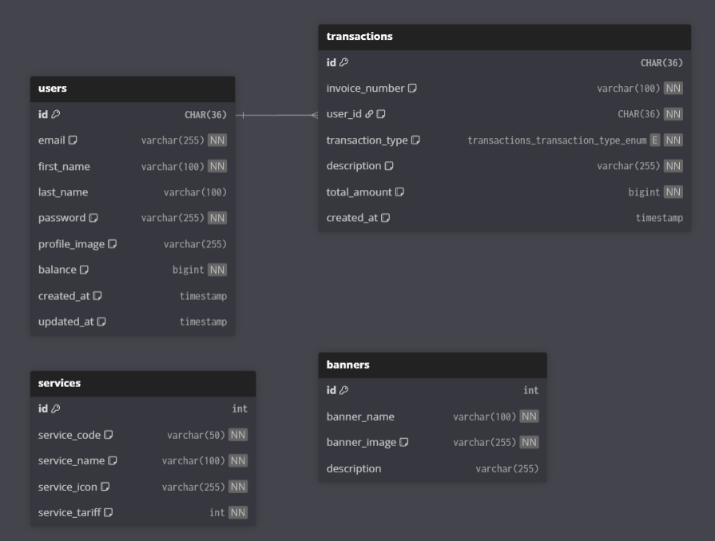

# SIMS PPOB REST API

Ini adalah REST API untuk _take-home test_ yang mengelola layanan PPOB (Payment Point Online Bank). API ini dibangun menggunakan **Node.js** dan **Express.js** dengan _raw query_ MySQL (tanpa ORM) dan otentikasi JWT, sesuai dengan spesifikasi yang diberikan.

---

## 🚀 Fitur Utama

-   **🔐 Modul Membership:** Registrasi, Login (JWT), Profil (Update & Upload Gambar).
-   **ℹ️ Modul Information:** Menampilkan daftar Banner dan Layanan PPOB yang diambil dari database.
-   **💰 Modul Transaksi:** Cek Saldo, Top Up Saldo, Pembayaran Layanan, dan Riwayat Transaksi (dengan paginasi).
-   **🛡️ Keamanan:** Menggunakan `bcrypt` untuk _hashing_ password, `Joi` untuk validasi _request_, dan _prepared statements_ untuk kueri database.
-   **🗃️ Manajemen Database:** Termasuk sistem migrasi dan _seeding_ kustom (tanpa ORM).

---

## 🛠️ Teknologi yang Digunakan

-   **Backend:** Node.js, Express.js
-   **Database:** MySQL (dengan `mysql2`)
-   **Authentication:** JSON Web Token (`jsonwebtoken`)
-   **Validasi:** Joi
-   **File Upload:** Multer (ke _storage_ memori)
-   **Lainnya:** `bcrypt`, `cors`, `dotenv`, `morgan`

---

## ER Diagram



atau dapat diakses melalui [link ini](https://dbdiagram.io/d/nutech-integrasi-685ff456f413ba35084eca17).

---

## ⚙️ Instalasi dan Konfigurasi

### Prasyarat

-   Node.js (v18 atau lebih baru)
-   Server MySQL

### 1. Clone Repositori

```bash
git clone [https://github.com/nantalira/nutech.git](https://github.com/nantalira/nutech.git)
cd nutech
```

### 2. Instal Dependensi

```bash
npm install
```

### 3. Konfigurasi Variabel Lingkungan

Salin file `.env.example` menjadi `.env` dan sesuaikan nilainya.

```env
PORT=3000
NODE_ENV=development
CORS_ORIGIN=http://localhost:3000,http://localhost:3001
DB_HOST=localhost
DB_USER=root
DB_PASSWORD=password
DB_NAME=nutech_db
JWT_SECRET=your-super-secret-key-nutech-ppob-api-2024
UPLOAD_PATH=public/images/profiles
BASE_URL=http://localhost:3000
```

-   Pastikan Anda membuat database di MySQL dengan nama yang sesuai (e.g., nutech_db).

### 4. Jalankan Migrasi dan Seed Database

Proyek ini menggunakan sistem migrasi dan seeding kustom berbasis raw query.

-   Untuk membuat tabel database:

```bash
npm run migrate
```

-   Untuk mengisi data awal (banners, services, test users):

```bash
npm run seed
```

-   (Opsional) Untuk reset database (Drop + Create + Seed):

```bash
npm run migrate:fresh
npm run seed
```

---

## 🚀 Menjalankan Aplikasi

-   Mode Development (dengan Nodemon):

```bash
npm run dev
```

-   Mode Production:

```bash
npm run start
```

_Catatan: Perintah start akan menjalankan migrate:fresh dan seed terlebih dahulu, yang akan menghapus semua data setiap kali server dimulai._

---

## 📚 Dokumentasi API

Setelah server berjalan, dokumentasi API (Swagger) dapat diakses melalui:

-   **Swagger UI**: `http://localhost:3000/api/v1/api-docs`

-   **Endpoint Utama**: `http://localhost:3000/api/v1`

-   **File Kontrak JSON**: `http://localhost:3000/docs/api.json` (disajikan dari public/docs/api.json)

Anda juga dapat mengakses api yang telah di-deploy di:

-   **Base URL**: `https://nutech-nantalira.up.railway.app/`

---

## 🏛️ Arsitektur

Proyek ini menggunakan arsitektur modular dengan pola Controller-Service-Repository untuk memisahkan tanggung jawab (Separation of Concerns).

-   **Controller** (\*.controller.js): Bertanggung jawab hanya untuk validasi request (menggunakan Joi) dan mengirim response HTTP.

-   **Service** (\*.service.js): Bertanggung jawab atas semua logika bisnis (misalnya, mengecek saldo, membuat token, mengelola database transaction).

-   **Repository** (\*.repository.js): Bertanggung jawab hanya untuk berinteraksi dengan database (menjalankan raw query MySQL).
